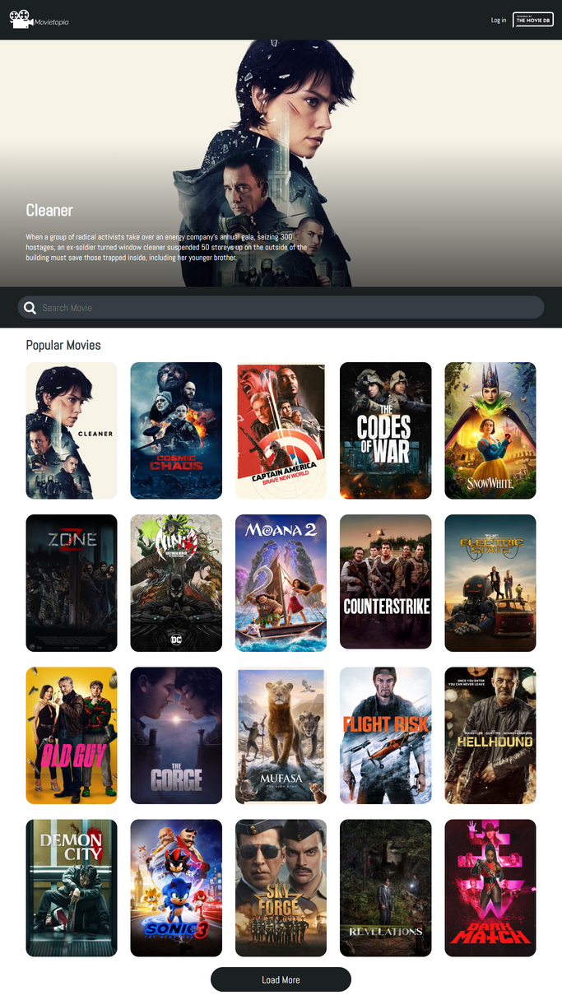

# Movietopia

Movietopia is a modern web application for movie enthusiasts to explore detailed information about their favorite films. The platform utilizes data from the TMDB API.

## Features

- Fetch movie data dynamically from the TMDB API.
- Display movies with relevant information in an elegant and responsive layout.
- Individual movie detail pages for further exploration.
- Smooth navigation and intuitive design.

## Tech Stack

- **Library:** React
- **Styling:** Styled Components
- **Routing/Navigation:** React Router

## Screenshots

## Authors

Peter Uadiale

- [Website](https://www.peteruadiale.com/)
- [LinkedIn](https://www.linkedin.com/in/peter-o-uadiale-69541a19a/)
